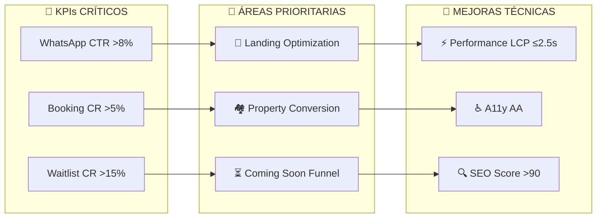
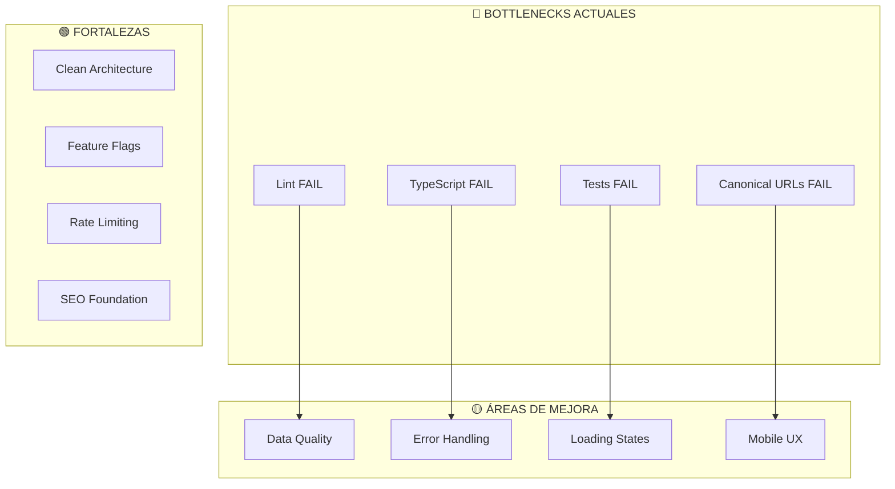
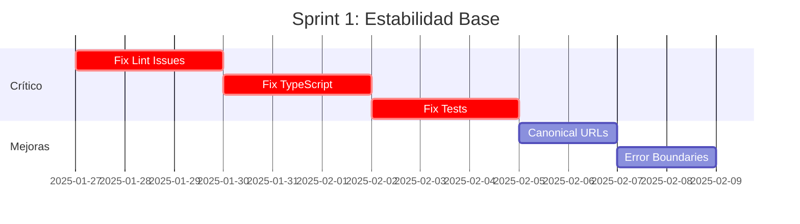
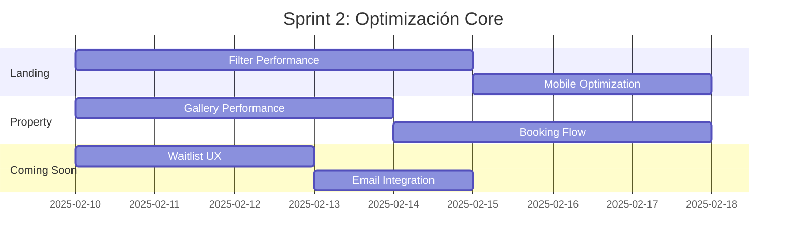
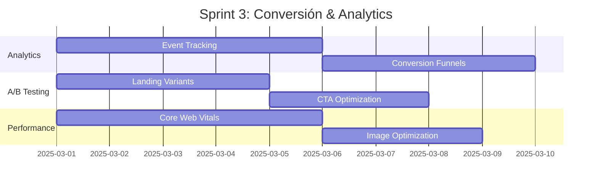

resolv# 🏗️ ARQUITECTURA VISUAL - HOMMIE 0% COMISIÓN

## 📊 DIAGRAMA DE ARQUITECTURA ACTUAL

```mermaid
graph TB
    %% USUARIOS
    User[👤 Usuario] --> Browser[🌐 Browser]
    
    %% FRONTEND - PÁGINAS PRINCIPALES
    subgraph "🎨 FRONTEND (Next.js 14 App Router)"
        subgraph "📱 PÁGINAS CORE"
            Home[🏠 / (Redirect)]
            Landing[🏢 /landing]
            Property[🏘️ /property/[slug]]
            ComingSoon[⏳ /coming-soon]
            MiBio[👤 /mi-bio]
        end
        
        subgraph "🧩 COMPONENTES"
            LandingClient[LandingClient.tsx]
            PropertyClient[PropertyClient.tsx]
            ComingSoonClient[ComingSoonClient.tsx]
            Filters[FilterBar.tsx]
            ResultsGrid[ResultsGrid.tsx]
            BuildingCard[BuildingCard.tsx]
            ImageGallery[ImageGallery.tsx]
            BookingForm[BookingForm.tsx]
        end
        
        subgraph "🎯 HOOKS"
            useBuildingsData[useBuildingsData.ts]
            useAdvancedFilters[useAdvancedFilters.ts]
            useBuildingsPagination[useBuildingsPagination.ts]
            useVirtualGrid[useVirtualGrid.ts]
        end
    end
    
    %% BACKEND - APIs
    subgraph "🔧 BACKEND (API Routes)"
        subgraph "🏢 BUILDINGS API"
            BuildingsAPI[/api/buildings]
            BuildingSlugAPI[/api/buildings/[slug]]
            BuildingsPaginatedAPI[/api/buildings/paginated]
        end
        
        subgraph "📅 BOOKING API"
            BookingAPI[/api/booking]
        end
        
        subgraph "📋 WAITLIST API"
            WaitlistAPI[/api/waitlist]
        end
        
        subgraph "💰 QUOTATIONS API"
            QuotationsAPI[/api/quotations]
        end
        
        subgraph "🎛️ ADMIN API"
            FlagsAPI[/api/flags/override]
            CompletenessAPI[/api/admin/completeness]
            DebugAPI[/api/debug-admin]
        end
    end
    
    %% DATA LAYER
    subgraph "🗄️ DATA LAYER"
        subgraph "📊 SUPABASE"
            SupabaseClient[supabase.ts]
            BuildingsTable[buildings]
            UnitsTable[units]
            WaitlistTable[waitlist]
        end
        
        subgraph "🔄 DATA ADAPTERS"
            DataLayer[data.ts]
            DeriveLayer[derive.ts]
            MappingV2[mapping-v2.ts]
            AssetplanAdapter[assetplan.ts]
        end
        
        subgraph "🎛️ FEATURE FLAGS"
            FlagsSystem[flags.ts]
            FeatureFlags[feature-flags.json]
        end
    end
    
    %% EXTERNAL SERVICES
    subgraph "🌐 EXTERNAL SERVICES"
        WhatsApp[📱 WhatsApp API]
        Analytics[📈 Analytics]
        Resend[📧 Resend Email]
    end
    
    %% FLUJOS DE DATOS
    Browser --> Home
    Home --> Landing
    Browser --> Property
    Browser --> ComingSoon
    
    Landing --> LandingClient
    Property --> PropertyClient
    ComingSoon --> ComingSoonClient
    
    LandingClient --> Filters
    LandingClient --> ResultsGrid
    ResultsGrid --> BuildingCard
    
    PropertyClient --> ImageGallery
    PropertyClient --> BookingForm
    
    %% API CONNECTIONS
    LandingClient --> BuildingsAPI
    PropertyClient --> BuildingSlugAPI
    BookingForm --> BookingAPI
    ComingSoonClient --> WaitlistAPI
    
    %% DATA FLOW
    BuildingsAPI --> DataLayer
    BuildingSlugAPI --> DataLayer
    BookingAPI --> DataLayer
    WaitlistAPI --> DataLayer
    
    DataLayer --> SupabaseClient
    DataLayer --> DeriveLayer
    DeriveLayer --> MappingV2
    
    %% EXTERNAL INTEGRATIONS
    BookingForm --> WhatsApp
    LandingClient --> Analytics
    WaitlistAPI --> Resend
    
    %% FEATURE FLAGS
    LandingClient --> FlagsSystem
    PropertyClient --> FlagsSystem
    ComingSoonClient --> FlagsSystem
    
    %% STYLING
    classDef corePage fill:#e1f5fe,stroke:#01579b,stroke-width:2px
    classDef api fill:#f3e5f5,stroke:#4a148c,stroke-width:2px
    classDef data fill:#e8f5e8,stroke:#1b5e20,stroke-width:2px
    classDef component fill:#fff3e0,stroke:#e65100,stroke-width:2px
    classDef external fill:#fce4ec,stroke:#880e4f,stroke-width:2px
    
    class Landing,Property,ComingSoon corePage
    class BuildingsAPI,BuildingSlugAPI,BookingAPI,WaitlistAPI api
    class DataLayer,SupabaseClient,DeriveLayer data
    class LandingClient,PropertyClient,ResultsGrid component
    class WhatsApp,Analytics,Resend external
```

## 🎯 ÁREAS DE ENFOQUE PARA DESARROLLO

### 🚀 **PRIORIDAD ALTA (Impacto Directo en KPIs)**



### 📊 **MÉTRICAS DE NEGOCIO**

| Área | KPI Actual | Meta | Impacto |
|------|------------|------|---------|
| **Landing** | WhatsApp CTR | >8% | 🟢 Alto |
| **Property Detail** | Booking CR | >5% | 🟢 Alto |
| **Coming Soon** | Waitlist CR | >15% | 🟢 Alto |
| **Performance** | LCP | ≤2.5s | 🟡 Medio |
| **A11y** | WCAG | AA | 🟡 Medio |

### 🔧 **BOTTLENECKS IDENTIFICADOS**



## 🛣️ ROADMAP DE DESARROLLO

### **SPRINT 1: Estabilidad Base** (1-2 semanas)


### **SPRINT 2: Optimización Core** (2-3 semanas)


### **SPRINT 3: Conversión & Analytics** (2-3 semanas)


## 🎯 **RECOMENDACIONES INMEDIATAS**

### **1. Estabilidad (Esta Semana)**
- ✅ Fix lint errors (`pnpm run lint --fix`)
- ✅ Fix TypeScript errors (`pnpm run typecheck`)
- ✅ Fix test failures (`pnpm run test`)
- ✅ Fix canonical URLs

### **2. Performance (Próxima Semana)**
- 🚀 Implementar virtual scrolling en ResultsGrid
- 🚀 Optimizar imágenes con next/image
- 🚀 Implementar ISR para property pages
- 🚀 Optimizar bundle size

### **3. Conversión (2-3 Semanas)**
- 📈 A/B testing en CTAs
- 📈 Optimizar booking flow
- 📈 Mejorar waitlist funnel
- 📈 Implementar remarketing

### **4. Analytics (3-4 Semanas)**
- 📊 Event tracking completo
- 📊 Conversion funnels
- 📊 User journey analysis
- 📊 Performance monitoring

## 🔍 **MÉTRICAS DE ÉXITO**

| Métrica | Actual | Meta | Timeline |
|---------|--------|------|----------|
| **LCP** | ~3.5s | ≤2.5s | Sprint 2 |
| **TTFB** | ~800ms | ≤600ms | Sprint 2 |
| **CLS** | ~0.1 | ≤0.1 | Sprint 2 |
| **A11y Score** | ~85 | ≥90 | Sprint 3 |
| **SEO Score** | ~80 | ≥90 | Sprint 3 |
| **Waitlist CR** | ~10% | ≥15% | Sprint 3 |
| **WhatsApp CTR** | ~5% | ≥8% | Sprint 3 |
| **Booking CR** | ~3% | ≥5% | Sprint 3 |

---

**📋 Próximos Pasos:**
1. **Ejecutar** `pnpm run lint --fix` para corregir errores críticos
2. **Revisar** TypeScript errors con `pnpm run typecheck`
3. **Corregir** test failures identificados
4. **Implementar** mejoras de performance priorizadas
5. **Monitorear** métricas de conversión semanalmente

*Diagrama generado el 2025-01-27 - Hommie 0% Comisión*
